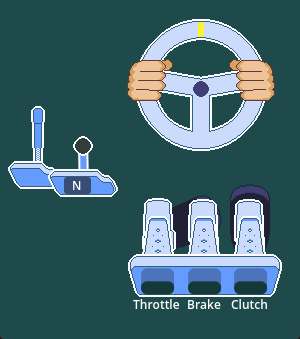

# RacingOverlay

A Godot-based racing overlay for streaming steering wheel inputs.

Supports most steering wheel-based input devices with a rebinding screen, and on compatible games, supports connecting to telemetry to display extra fun information such as car roll and car speed as transformations of the overlay.

## Building

Requires Godot 4.5.  
Import and editing of Aseprite assets requires [Aseprite](https://github.com/aseprite/aseprite) installed and configured in the Aseprite Wizard plugin.

## Enabling support for game connections

### Dirt 2.0

Make sure the game is closed when applying these changes:

1. Navigate to `C:\Users\<User>\Documents\my games\DiRT Rally 2.0\hardwaresettings`
2. Open `hardware_settings_config.xml`
3. Locate the line `<udp enabled="false" extradata="1" ip="127.0.0.1" port="20777" delay="1" />`
4. Replace it with `<udp enabled="true" extradata="3" ip="127.0.0.1" port="20777" delay="1" />`

Note: The value of `port="xxxxx"` must match the port number in the overlay settings. By default both should be 20777.

### BeamNG

1. Open BeamNG
2. Navigate to Options > "... Other" > Protocols
3. Turn on "MotionSim UDP protocol" option

Note: The value under "Port" must match the one in the overlay settings. By default both should be 4444.
